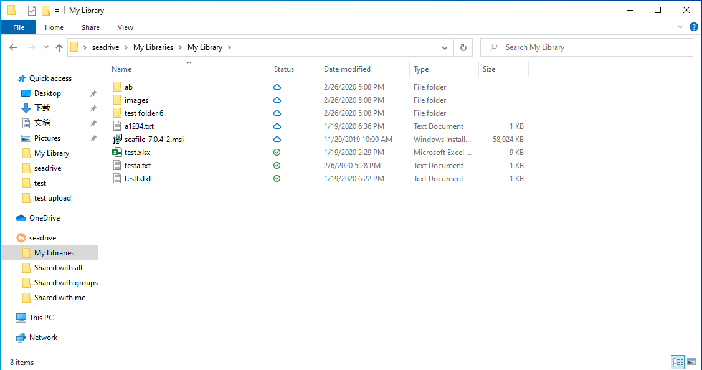
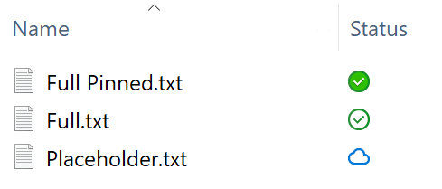
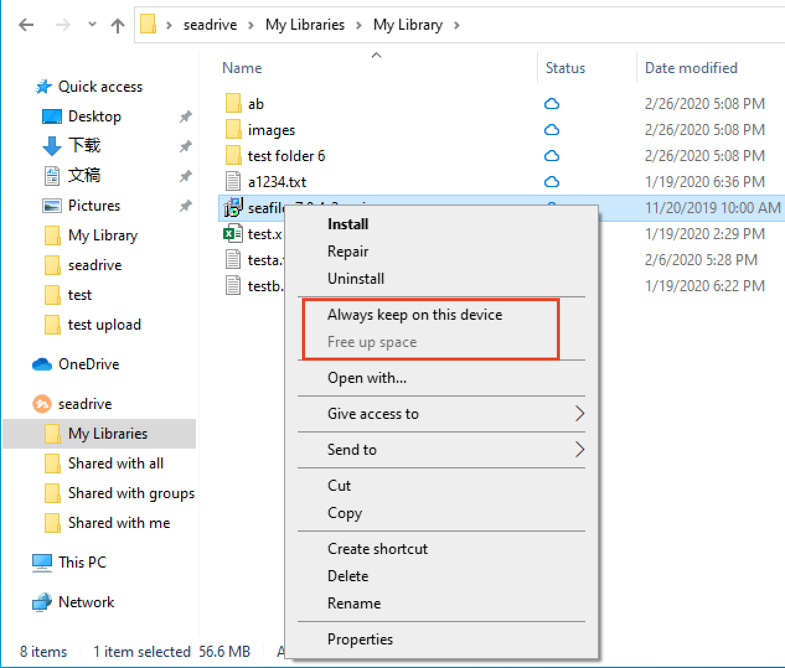

#  نظاام Zain Drive 2.0 لنظام Windows 10

تم إعادة تصميم ZainDrive 2.0 (والإصدارات المستقبلية) بتكامل أعمق مع نظام التشغيل Windows 10. يدعم إصدار 1709 من Windows 10 (تحديث الخريف لعام 2017) والإصدارات الأحدث. نوصي بترقية مستخدمي Windows 10 إلى ZainDrive 2.0 لتجربة أكثر سلاسة وتكاملًا مع القرص الافتراضي المحلي.

## تثبيت والوصول إلى القرص الافتراضي

يمكنك تنزيل Zaindrive 2.0 من [موقع Seafile الرسمي](https://www.seafile.com/en/download/). بعد التثبيت وتسجيل الدخول إلى حساب Seafile الخاص بك، ستبدأ Zaindrive في تنزيل قائمة المكتبة وقائمة الملفات من الخادم (تمامًا مثل Zaindrive 1.0.x). قد يستغرق ذلك بعض الوقت، اعتمادًا على عدد الملفات المتاحة في حساب Seafile الخاص بك. التنزيل يكون تدريجيًا، لذا في الوقت الحالي يمكنك الوصول إلى بعض الملفات في القرص الافتراضي.

للوصول إلى القرص الافتراضي، قم بفتح مستكشف الملفات في Windows. هناك عنصر "Zaindrive" في اللوحة التنقلية لمستكشف الملفات في Windows.

## الوصول إلى الملفات في القرص الافتراضي

تم تجميع المكتبات في 4 فئات في القرص الافتراضي: مكتباتي، المشاركة معي، المشاركة مع المجموعات، والمشاركة مع الجميع.

كما يمكن ملاحظة أن رموز حالة الملفات متكاملة أكثر مع مستكشف الملفات في Windows. تختلف الرموز قليلاً عن الإصدار 1.0.

تُنشئ الملفات في القرص الافتراضي كـ "عناصر إشارية" في نظام الملفات المحل

ي. يمكن فهمها بالحالات التالية:

* **ملف إشاري**: تمثيل فارغ للملف ويمكن فتحه فقط عند وجود اتصال بالشبكة.
* **ملف كامل**: تم تنزيل الملف وحفظه محليًا. يتم التنزيل تلقائيًا عند فتح ملف إشاري لأول مرة. هذه الملفات متاحة في أي وقت تفتح فيه Zaindrive بغض النظر عن اتصال الشبكة. قد تقرر نظام التشغيل مسح ملف كامل عندما يحتاج إلى مزيد من مساحة القرص.
* **ملف كامل مع تثبيت**: تم تنزيل الملف وحفظه محليًا. يتم ضمان توفره دون اتصال بالشبكة.

يمكنك التحكم في الملفات والمجلدات التي تم تخزينها محليًا. يمكن تغيير ذلك من القائمة المنسدلة عند النقر بزر الماوس الأيمن على ملف أو مجلد. اختر "Always keep on this device" عندما ترغب في تثبيت ملف أو مجلد محليًا؛ اختر "Free up space" عندما ترغب في تنظيف ذاكرة التخزين المؤقت لملف أو مجلد.

في Zaindrive 1.0، لم يتم تحديث الملفات المخزنة محليًا تلقائيًا عند تحديثها على الخادم. في Zaindrive 2.0، يتم تحديث الملفات الكاملة والمثبتة تلقائيًا ومزامنتها مع الخادم.

## تنزيل الملفات والتحكم فيها

عندما تفتح ملفًا إشاريًا، سيبدأ نظام التشغيل تنزيله تلقائيًا. إذا استغرق التنزيل وقتًا قد يتسبب في انتظار طويل، ستظهر شريط التقدم في مستكشف الملفات ويمكنك إلغاء

 التنزيل.

في بعض الأحيان، قد يحاول تطبيق خلفي تنزيل ملف في القرص الافتراضي (مثل برنامج مكافحة الفيروسات). ستتلقى إشعارًا من نظام التشغيل بشأن ذلك، ويمكنك اختيار إلغاء التنزيل أو منع التطبيق من تنزيل الملفات تلقائيًا في المستقبل.

## الأسئلة المتكررة

### هل يمكنني إنشاء وحذف وإعادة تسمية المكتبات؟

نعم. عند إنشاء وحذف أو إعادة تسمية مجلدات المكتبة في القرص الافتراضي، سيتم تنفيذ العملية على الخادم. يمكنك فقط إنشاء وحذف وإعادة تسمية المكتبات في فئة "مكتباتي". إنشاء وحذف وإعادة تسمية المكتبات في فئات أخرى سيتم تجاهلها.

### هل يمكنني إنشاء ملفات أو مجلدات خارج مجلد المكتبة؟

نعم. ولكن سيتم تجاهل الملفات التي تم إنشاؤها خارج مجلد المكتبة ولن تتم مزامنتها مع الخادم. سيتم التعامل مع المجلد الجديد تحت مجلد "مكتباتي" كمكتبة جديدة.

### هل يمكنني الوصول إلى المكتبات المشفرة؟

نعم. افتراضيًا، لا يتم مزامنة المكتبات المشفرة وعرضها في القرص الافتراضي. يجب عليك اختيار المكتبات المشفرة التي ترغب في مزامنتها يدويًا وإدخال كلمة المرور. ما عليك سوى النقر بزر الماوس الأيمن على رمز Zaindrive في منطقة علبة النظام واختيار "Show encrypted libraries". ستظهر نافذة ويمكنك اختيار مزامنة المكتبة المشفرة أو عدم مزامنتها.

### هل هو متوافق مع Zaindrive 1.0؟

نعم. يمكنك استخدام Zaindrive 2.0 و Zaindrive 1.0 في نفس الوقت، ولكنها ستعمل بشكل مستقل. ستظهر مكتباتك وملفاتك في الإصدارين بشكل منفصل. يمكنك نسخ ولصق الملفات بين الإصدارين.
