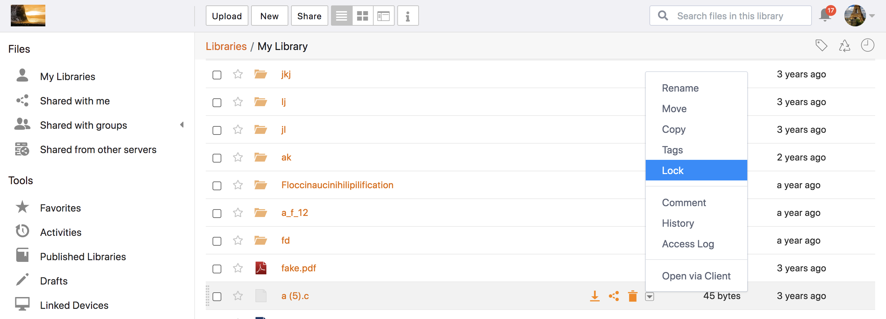
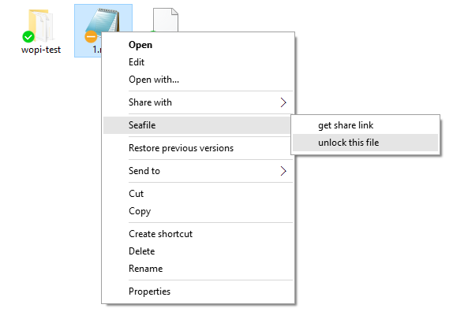

  ## تأمين الملفات

عندما يعمل أكثر من شخص على تعاون في ملف، فمن المرجح أن يقوم أكثر من شخص بتعديل الملف في نفس الوقت. تتعامل Seafile بشكل رائع مع هذا الوضع من خلال ملفات التعارض. ولكن من المفيد في كثير من الأحيان تأمين الملف عندما يرغب شخص واحد في تعديله حصريًا. تدعم إصدار Seafile المهني قفل الملف.

يعمل قفل الملف على كل من تطبيق الويب وتطبيق المزامنة السطحية. سنقدمهما واحدًا تلو الآخر.

## قفل الملف على تطبيق الويب

لتأمين ملف، يمكنك الانتقال إلى مجلد الملف في تطبيق الويب والنقر على قائمة الإجراءات "العمليات".

بعد تأمين الملف، يمكنك رؤية علامة "توقف" حمراء في زاوية أيقونة الملف. عند تحريك الماوس على علامة التوقف، يمكنك رؤية من قام بتأمين الملف. ويمكنك أيضًا إلغاء تأمين الملف إذا قمت أنت بتأمينه. ولكن لا يمكنك إلغاء تأمين الملفات التي تم تأمينها من قبل الآخرين.

## قفل الملف في تطبيق المزامنة السطحية

بعد مزامنة مكتبة ما مع تطبيق المزامنة السطحية، يمكنك تأمين/إلغاء تأمين الملفات في تلك المكتبة داخل مستكشف الملفات في نظام التشغيل الخاص بك مثل "File Explorer" في نظام Windows أو "Finder" في نظام Mac OS.

لتأمين ملف، انقر بزر الماوس الأيمن على ملف متزامن واختر "قفل هذا الملف" في قائمة "Zaindrive".

إذا قمت أنت بتأمين ملف، سترى علامة "توقف" برتقالية على أيقونة الملف. يمكنك اختيار إلغاء تأمينه.

إذا قام مستخدم آخر بتأمين الملف، سترى علامة "توقف" حمراء على أيقونة الملف. يتم تعيين الملف تلقائيًا كقراءة فقط. لا يمكنك تعديله حتى يتم إلغاء تأمينه.

إذا لم يتم مزامنة مكتبة معينة، ما زال يمكنك استخدام مستعرض الملفات السحابي لتأمين وإلغاء تأمين الملفات فيه.

## قفل الملفات التلقائي لملفات Office

بعد مزامنة مكتبة مع التطبيق السطحي، عندما تفتح ملفًا من Microsoft Office داخل المكتبة، يقوم Zaindrive بتأمين الملف تلقائيًا. عند إغلاق الملف، يقوم Zaindrive بإلغاء تأمينه تلقائيًا. يتم نشر حالة القفل على الأجهزة الأخرى التي تقوم بمزامنة هذه المكتبة. وهذا يمنع التحرير المتزامن لنفس الملف في Office ويعزز التعاون بشكل ملحوظ.

## تفاصيل حول قفل الملفات

هنا بعض النصائح المفيدة حول كيفية عمل قفل الملفات:

* يمكن إلغاء قفل الملفات فقط من قبل المستخدم الذي قام بتأمينه.
* لا يمكن تعديل الملفات المؤمنة أو نقلها أو إعادة تسميتها أو حذفها من قبل المستخدمين الآخرين. ولكن يمكن للمستخدمين الآخرين ما زالت القدرة على نقل أو حذف أو إعادة تسمية المجلد الرئيسى للملف المؤمن. الهدف الرئيسي لقفل الملف هو منع التحرير المتزامن.
* عند إعادة تسمية أو نقل مجلد الرئيسى للملف المؤمن داخل نفس المكتبة، يظل الملف مؤمنًا بعد العملية.
