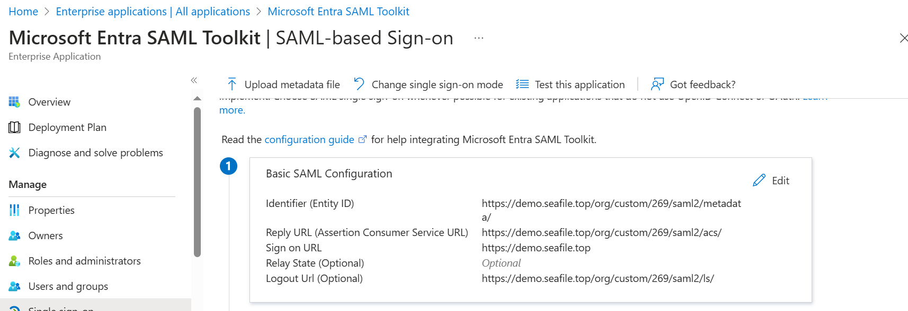
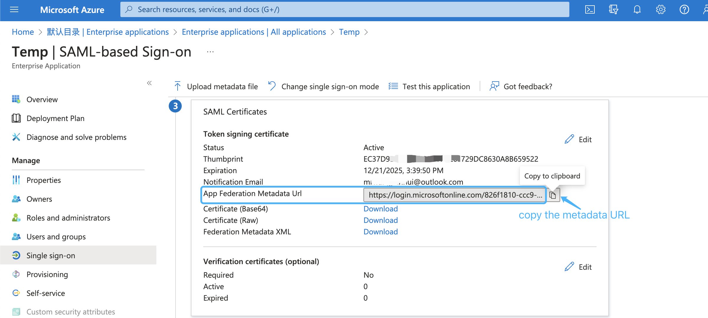
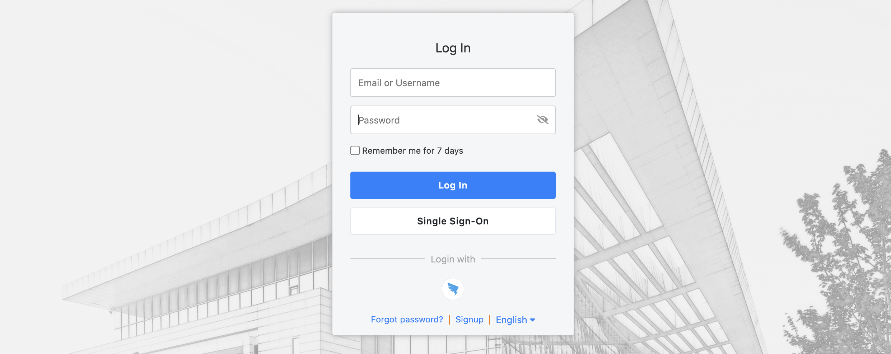
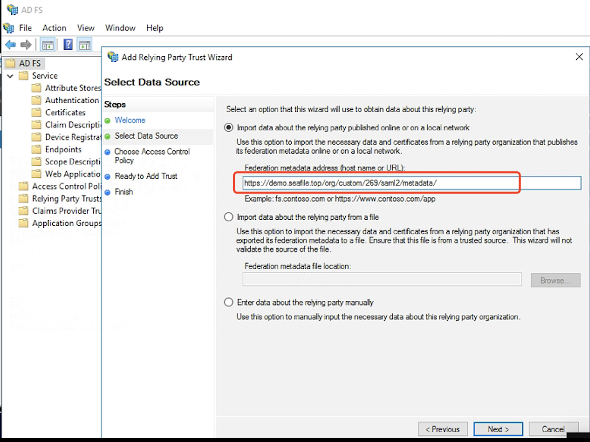
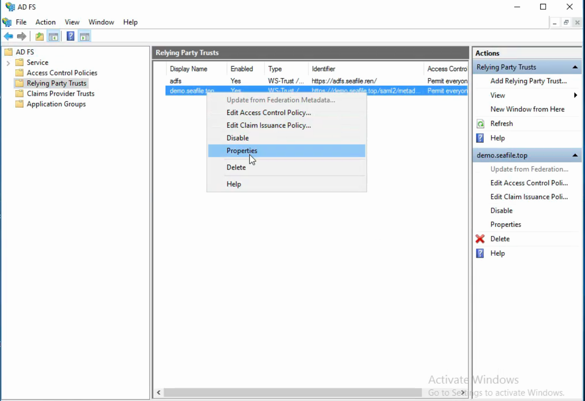
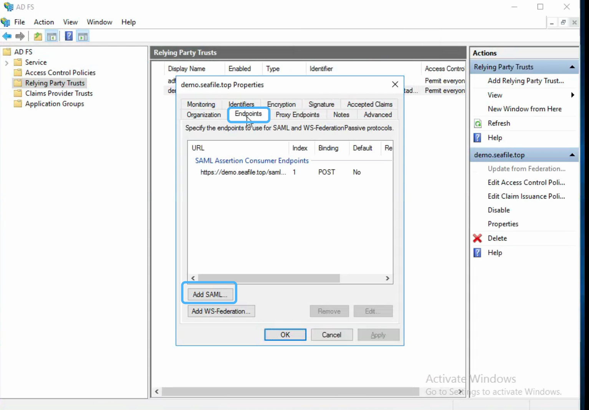
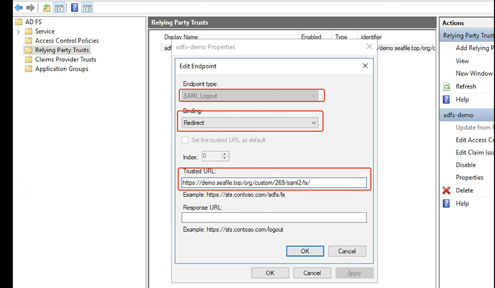

# Integration with ADFS/SAML single sign-on

**NOTE**: The following operations can only be performed by organization administrators.

The detailed steps depends on which ADFS service you use. We provide integration steps for Azure SAML SSO and on-premise ADFS.

## Integration with Microsoft Azure SAML single sign-on app

If you use Microsoft Azure SAML app to achieve single sign-on, please follow the steps below:

First of all, please add SAML application and assign users, refer to: [add an Azure AD SAML application](https://docs.microsoft.com/en-us/azure/active-directory/manage-apps/add-application-portal), [create and assign users](https://docs.microsoft.com/en-us/azure/active-directory/manage-apps/add-application-portal-assign-users)

And then enter the team admin interface and find the SAML config panel.  There are some values prepared for you to use to configure your identity Provider. The format of URL are including:

* Identifier:  https://example.com/org/custom/{org_id}/saml2/metadata/
* Reply URL: https://example.com/org/custom/{org_id}/saml2/acs/
* Sign on URL:   https://example.com
* Logout URL:  https://example.com/org/custom/{org_id}/ls/,

Then, setup these URLs of the SAML app by copying the specific URL to the SAML Configuration of your Idp in ADFS.

__Note__: The {org_id} of the URL should be the ID of organization, and can only contain integer characters.

Next, copy the metadata URL of the SAML app:

and paste it into the organization admin interface, e.g:

Next, download the base64 format SAML app's certificate and rename to idp.crt:

 Open the idp.crt and copy the content to the organization admin interface:

Next, you have to verify your ownership of the domain name you use to login. Please input the name of your company's domain and click the "check" button, and a DNS TXT value will be automatically generated. Then, you need to create a new TXT record in your DNS host by copying and pasting the generated value. It may take up to 72 hours for your domain to be verified.

**Next**, [edit saml attributes & claims](https://learn.microsoft.com/en-us/azure/active-directory/develop/saml-claims-customization). Keep the default attributes & claims of SAML app unchanged, the _uid_ attribute must be added, the _mail_ and _name_ attributes are optional, e.g.:

**Finally**, open the browser and enter the Seafile login page, click `Single Sign-On`, e.g.

in the new page, enter your email address ending with the company domain name, e.g.

Click the `Log In` button will jump to the SAML app login page, e.g.:

## Integration with on-premise ADFS

If you use Microsoft ADFS to achieve single sign-on, please follow the steps below:

**First**, please make sure the following preparations are done:

1. A Windows Server with [ADFS](https://learn.microsoft.com/en-us/windows-server/identity/active-directory-federation-services) installed. For configuring and installing ADFS you can see [this article](https://learn.microsoft.com/en-us/windows-server/identity/ad-fs/deployment/deploying-a-federation-server-farm).

2. A valid SSL certificate for ADFS server, and here we use `temp.adfs.com` as the domain name example.

3. A valid SSL certificate for Seafile server, and here we use `demo.seafile.com` as the domain name example.

**Second**, And then enter the team admin interface and find the SAML config panel. There are some values prepared for you to choose to configure your identity Provider in the relying party trust. Such as identifier, Reply URL,  Logout URL and so on.

**Next**, setup the federation metadata URL of Microsoft ADFS in the organization admin interface. The format of the federation metadata URL is: `https://{your ADFS domain name}/federationmetadata/2007-06/federationmetadata.xml`, e.g:

**Next**, download the base64 format certificate and copy the content to the certificate field:

* Navigate to the _ADFS_ management window. In the left sidebar menu, navigate to **Services** > **Certificates**.

* Locate the _Token-signing_ certificate. Right-click the certificate and select **View Certificate**.

* In the dialog box, select the **Details** tab.

* Click **Copy to File**.

* In the _Certificate Export Wizard_ that opens, click **Next**.

* Select **Base-64 encoded X.509 (.CER)**, then click **Next**.

* Named it **idp.crt**, then click **Next**.

* Click **Finish** to complete the download.

* And then upload the idp.crt in the organization admin interface:

Next, you have to verify your ownership of the domain name you use to login. Please input the name of your company's domain and click the "check" button, and a DNS TXT value will be automatically generated. Then, you need to create a new TXT record in your DNS host by copying and pasting the generated value. It may take up to 72 hours for your domain to be verified.

Next, add [relying party trust](https://learn.microsoft.com/en-us/windows-server/identity/ad-fs/operations/create-a-relying-party-trust#to-create-a-claims-aware-relying-party-trust-using-federation-metadata):

* Log into the ADFS server and open the ADFS management.

* Under **Actions**, click **Add Relying Party Trust**.

* On the Welcome page, choose **Claims aware** and click **Start**.

* Select **Import data about the relying party published online or on a local network**, type your organization metadate url in **Federation metadata address (host name or URL)**, and then click **Next**. Your organization metadate url format is: `https://example.com/org/custom/{org_id}/saml2/metadata/`, e.g.:

* On the **Specify Display Name** page type a name in **Display name**, e.g. `Seafile`, under **Notes** type a description for this relying party trust, and then click **Next**.

* In the **Choose an access control policy** window, select **Permit everyone**, then click **Next**.

* Review your settings, then click **Next**.

* Click **Close**.

**Next**, create claims rules:

* Open the ADFS management, click **Relying Party Trusts**.

* Right-click your trust, and then click **Edit Claim Issuance Policy**.

* On the **Issuance Transform Rules** tab click **Add Rules**.

* Click the **Claim rule template** dropdown menu and select **Send LDAP Attributes as Claims**, and then click **Next**.

* In the **Claim rule name** field, type the display name for this rule, such as **Seafile Claim rule**. Click the **Attribute store** dropdown menu and select **Active Directory**. In the **LDAP Attribute** column, click the dropdown menu and select **User-Principal-Name**. In the **Outgoing Claim Type** column, click the dropdown menu and select **UPN**. And then click **Finish**.

* Click **Add Rule** again.

* Click the **Claim rule template** dropdown menu and select **Transform an Incoming Claim**, and then click **Next**.

* In the **Claim rule name** field, type the display name for this rule, such as **UPN to Name ID**. Click the **Incoming claim type** dropdown menu and select **UPN**(It must match the **Outgoing Claim Type** in rule `Seafile Claim rule`). Click the **Outgoing claim type** dropdown menu and select **Name ID**. Click the **Outgoing name ID format** dropdown menu and select **Email**. And then click **Finish**.

* Click **OK** to add both new rules.

__Note__: When creating claims rule, you can also select other LDAP Attributes, such as E-Mail-Addresses, depending on your ADFS service.

**Next**, configure the logout page, e.g.:

The format of the logout URL is: `https://example.com/org/custom/{org_id}/saml2/ls/`, e.g.:

**Finally**, open the browser and enter the Seafile login page, click `Single Sign-On`. In the new page, enter your email address ending with the company domain name, click the `Log In` button will jump to the ADFS login page.
